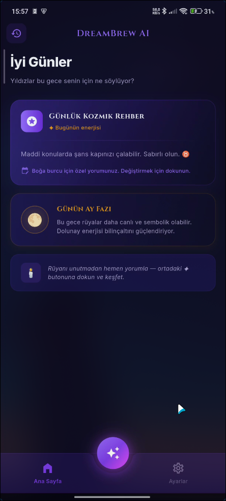
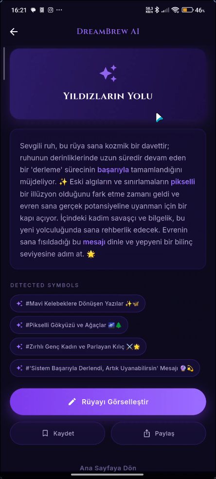
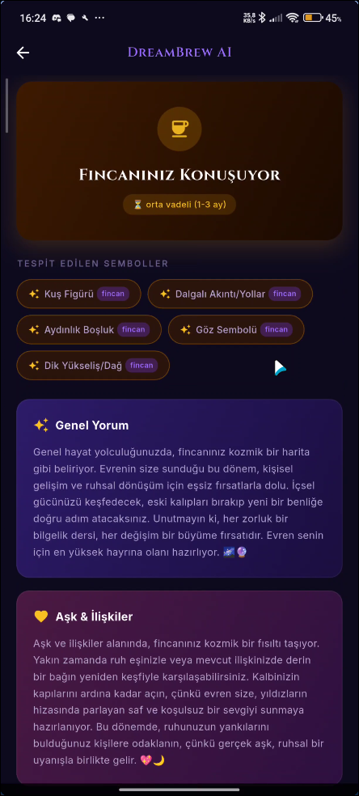
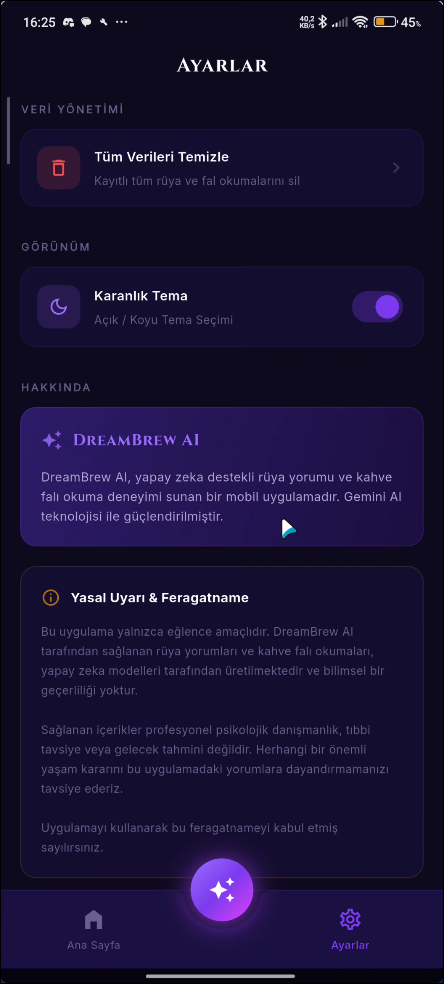

# ☕ DreamBrew AI

> Yapay Zeka Destekli Mistik Rüya Yorumu & Kahve Falı Okuma Uygulaması

<p align="center">
  
  
  
  
</p>

---

## ✨ Uygulama Hakkında

**DreamBrew AI**, yapay zeka teknolojisini mistik deneyimle birleştiren modern bir mobil uygulamadır. Kullanıcılar rüyalarını yazılı olarak anlattığında veya kahve fincanı fotoğrafını yüklediğinde, **Google Gemini AI** modeli yorumları oluşturur ve kullanıcıya sunar.

### 🔮 Temel Özellikler

| Özellik | Açıklama |
|---------|----------|
| **Rüya Yorumu** | Rüyanızı yazın, AI sembolik analiz ve psikolojik yorum sunsun |
| **Kahve Falı** | Fincan fotoğrafını yükleyin, AI sembolları tanımlayıp fal baksın |
| **Görsel Üretimi** | Yorumlarınıza özel mistik görseller üretin (Gemini Image) |
| **Geçmiş Kayıtları** | Tüm okumalarınız Hive ile yerel olarak saklanır |
| **Paylaşım** | Yorumlarınızı WhatsApp, Instagram vb. ile paylaşın |
| **Dark / Light Tema** | Mistik karanlık veya aydınlık tema seçeneği |
| **Burç Seçimi** | Onboarding'de burcunuzu seçerek kişiselleştirilmiş rehber alın |

---

## 📸 Ekran Görüntüleri

<!-- Ekran görüntülerini buraya ekleyin -->
<p align="center">
  
  
  
  
</p>

---

## 🏗️ Mimari

Proje **Clean Architecture** prensiplerine uygun olarak katmanlı yapıda tasarlanmıştır:

```
lib/
├── core/                   # Paylaşılan altyapı
│   ├── di/                 # Dependency Injection (GetIt)
│   ├── local_storage/      # Hive modelleri & servisleri
│   ├── network/            # ApiClient (Dio + Gemini)
│   ├── router/             # GoRouter yapılandırması
│   ├── theme/              # AppColors, AppTheme, ThemeCubit
│   └── widgets/            # Paylaşılan widget'lar
├── features/
│   ├── dream/              # Rüya Yorumu modülü
│   ├── fortune/            # Kahve Falı modülü
│   ├── history/            # Geçmiş Kayıtlar modülü
│   ├── home/               # Ana Sayfa modülü
│   ├── onboarding/         # Giriş / Burç Seçimi
│   ├── settings/           # Ayarlar modülü
│   └── visualization/      # AI Görsel Üretimi modülü
```

Her feature modülü kendi içinde `data/`, `domain/`, `presentation/` katmanlarına ayrılmıştır.

---

## 🛠️ Kullanılan Teknolojiler

| Teknoloji | Açıklama |
|-----------|----------|
| **Flutter** | Cross-platform UI framework |
| **Dart** | Programlama dili |
| **Google Gemini AI** | Metin yorumlama & görsel üretim (`gemini-2.5-flash`) |
| **Dio** | HTTP istemcisi |
| **Hive** | Yerel NoSQL veritabanı |
| **flutter_bloc** | State Management (Cubit / Bloc) |
| **GetIt** | Dependency Injection |
| **GoRouter** | Deklaratif navigasyon |
| **SharedPreferences** | Yerel ayarlar (tema, burç) |
| **share_plus** | Yerel paylaşım menüsü |
| **google_fonts** | Cinzel, Inter tipografisi |
| **flutter_dotenv** | Ortam değişkenleri yönetimi |

---

## 🚀 Kurulum

### Gereksinimler
- Flutter SDK `^3.9.2`
- Dart SDK `^3.9.2`
- Bir Google Gemini API anahtarı

### Adımlar

```bash
# 1. Repoyu klonlayın
git clone https://github.com/YOUR_USERNAME/dreambrew-ai.git
cd dreambrew-ai

# 2. Bağımlılıkları yükleyin
flutter pub get

# 3. .env dosyasını oluşturun
cp .env.example .env
```

### ⚙️ `.env` Yapılandırması

Proje kökünde `.env` dosyasını oluşturun:

```env
# Gemini API Anahtarınız (Google AI Studio'dan alın)
GEMINI_API_KEY=your_api_key_here

# Free tier kullanıyorsanız true yapın
# (Görsel üretim devre dışı kalır)
IS_FREE_TIER=true
```

> **Not:** API anahtarınızı [Google AI Studio](https://aistudio.google.com/) üzerinden ücretsiz edinebilirsiniz.

### Çalıştırma

```bash
# Android
flutter run

# APK oluşturma
flutter build apk --release
```

---

## 📂 Proje Yapısı — Özet

```
dreambrew_ai/
├── .env                    # API anahtarı (gitignore'da)
├── .env.example            # Örnek ortam değişkenleri
├── pubspec.yaml            # Bağımlılıklar
├── README.md               # Bu dosya
└── lib/
    ├── main.dart           # Uygulama giriş noktası
    └── ...                 # Yukarıdaki mimari yapıya bakınız
```

---

## ⚠️ Yasal Uyarı

Bu uygulama **yalnızca eğlence amaçlıdır**. DreamBrew AI tarafından sağlanan rüya yorumları ve kahve falı okumaları yapay zeka modelleri tarafından üretilmektedir ve **bilimsel bir geçerliliği yoktur**. Herhangi bir önemli yaşam kararını bu uygulamadaki yorumlara dayandırmamanızı tavsiye ederiz.

---

## 📄 Lisans

Bu proje [MIT Lisansı](LICENSE) altında lisanslanmıştır.

---

<p align="center">
  Yapay zeka ile güçlendirilmiş mistik deneyim ✨<br/>
  <strong>DreamBrew AI</strong> — 2026
</p>
